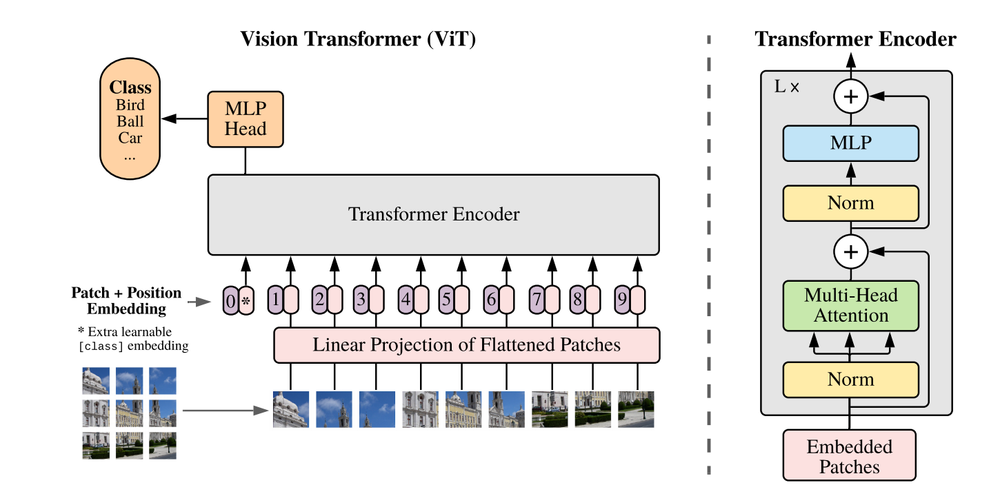
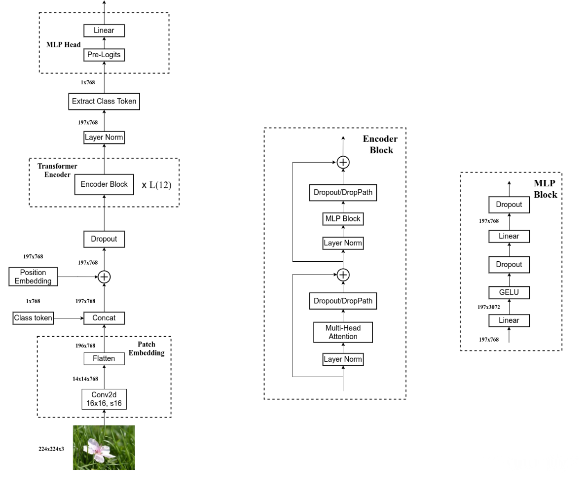
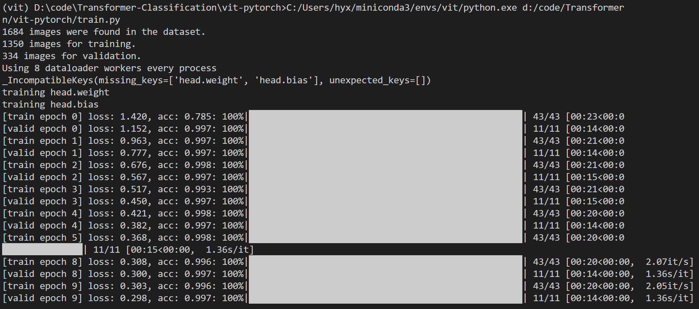
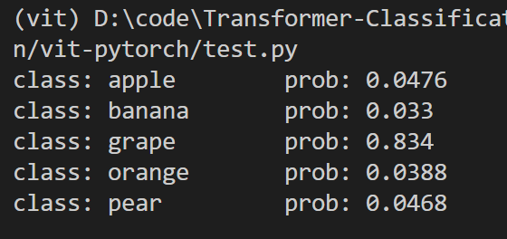
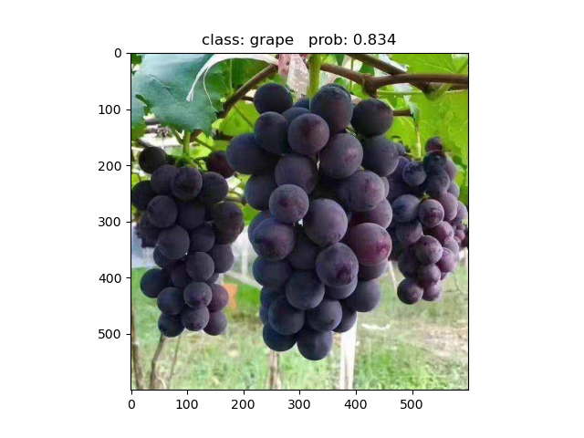

# vit-pytorch
 使用pytorch复现vit模型（图像分类）

## 1、模型结构
以往CNN模型中使用注意力机制仅仅是局部替换或添加注意力模块，但受Transformer的启发，VIT将采用Transformer替换CNN中的所有卷积模块。实验证明，在小数据集上，VIT的表现不如CNN，但在大型或中型数据集上，VIT的效果将优于CNN。

上图为VIT的结构示意图，首先将图片进行分割成若干个子图，并按顺序排列。实验中是将图片分割为16x16x3=768的大小，故采用长度为768的向量对图片进行编码。由于是分类任务，所以将在编码向量中添加一个class token作为类别标志，因此向量长度变为768+1=769。

接着将向量送入Transformer的解码器结构，由于我们只需要生成对应的类别信息，所以不需要使用Decoder。通过Transformer编码器后的结果向量，我们只需要提取获得的类别信息即可，故仅输出769长度的向量中的class token即可，并将其输入到MLP Head结构中，映射到类别维度数量即可。

## 2、实验结果
实验训练了一个五分类的水果数据集，结果如下：

训练结果

测试输出

测试图片

## 参考
1、https://blog.csdn.net/qq_37541097/article/details/118242600

2、https://arxiv.org/abs/2010.11929